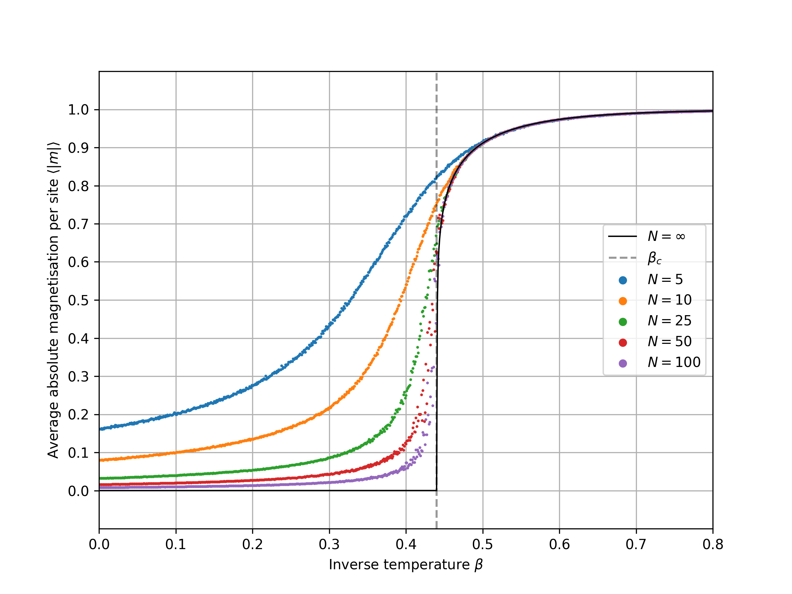

# 2D Ising Model MCMC Integration In Rust

Computes the (average) absolute magnetization per lattice site for the (standard ferromagnetic i.e. $J=1$) 2D Ising model in thermal equilibrium for a given range of inverse temperature values.

Uses Markov Chain Monte Carlo integration with the Metropolis-Hastings algorithm.  
The $2D$ Ising model and the concrete implementation of the Metropolis-Hastings algorithm are explained in detail [in the documentation](doc/ising_doc.pdf).  
Runs simulations for different inverse temperatures in parallel.  
The main code running the simulation is in the main.rs file in the src directory.

The data displayed in the following figure was obtained using this code ($N$ is the lattice size):



The $N=\infty$ labeled line is the exact solution in the infinite lattice limit.
A jupyter notebook and the data to produce the above figure are included in the "visualization" directory.

**Performance**:  
It takes around 200 seconds to generate the $N=100$ data in the above figure on my intel i7-9700k (8 cores@5Ghz).  
The precise parameters were: "N=100, N_CYCLE=10000, N_BURNCYCLES=1000, N_MAG=10000, N_BETASAMPLES =1000, BETA_MIN=0.00, BETA_MAX=1.00".
See the comments in the "config.toml" file for descriptions of what these parameters do.

## Usage

This is a learning project.
Use at your own risk.

- enter the desired parameters into the self explanatory "config.toml" file in the main directory
- type ```cargo build --release``` into the console while in the main directory to (re)-compile the program (necessary after every parameter change)
- execute the binary "ising" in the target/release directory
- after execution a file named "output" will appear in the same folder. This file contains the calculated beta and magnetization values in CSV format
