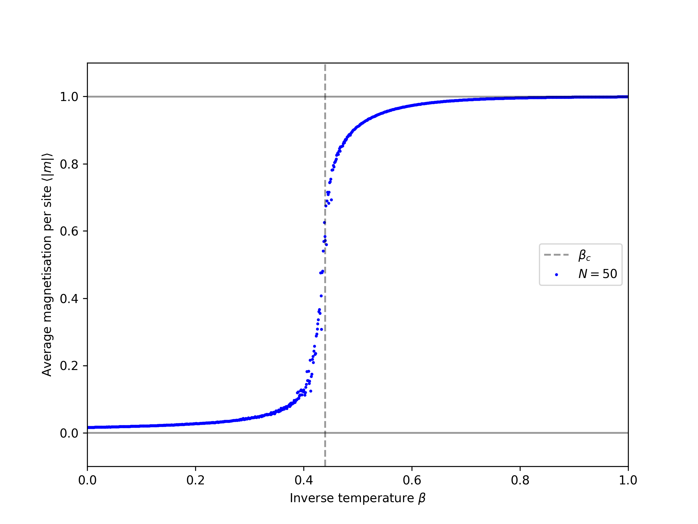

# 2D Ising Model MCMC Simulation In Rust :rocket:

Computes the (average) absolute magnetization per lattice site for the (standard) 2D Ising model in thermal equilibrium for different values of the inverse temperature.  
Uses Markov Chain Monte Carlo Integration with the Metropolis-Hastings algorithm.  
The main code running the simulation is in the main.rs file.

## Usage

Use at your own risk.
This is a learning project, so it might contain errors or poor coding.

- enter the desired parameters into the self explanatory "config.toml" file in the main directory
- type ```cargo build --release``` into the console while in the main directory to (re)-compile the program (necessary after every parameter change)
- execute the binary "ising" in the target/release directory
- after execution a file named "output" will be created in the same folder. This file contains the calculated beta and magnetization values in CSV format

## Results

The data to produce the below figure was generated using the code:

